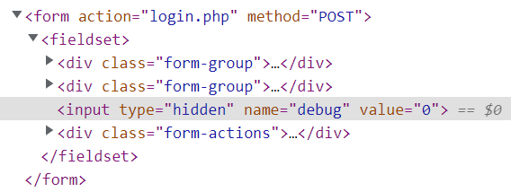
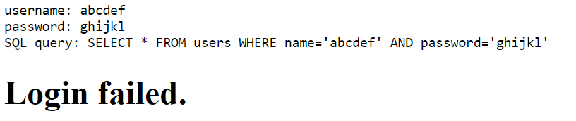

# Irish-Name-Repo 1

## Problem Description

There is a website running at `https://jupiter.challenges.picoctf.org/problem/39720/` ([link](https://jupiter.challenges.picoctf.org/problem/39720/)) or http://jupiter.challenges.picoctf.org:39720. Do you think you can log us in? Try to see if you can login!

| Points  | Category          | Author          |
| ------- | ----------------- | --------------- |
| 300     | Web Exploitation  | Matthew Ekaireb |

### Writeup 
On the given webpage, navigating to the login page shows a username and password field.  When inspecting the form, a hidden field named `debug` is shown. By default, the value is `0`.

Setting it to `1` and submitting `abcdef` as the username and `ghijkl` as the password will yield:

In order to have this SQL query return a user, SQL Injection can be used. 

SQL injection is when a user provides an SQL statement that will run on a database, unknown to the database administrator. In order commit SQL injection, the SQL statement must be escaped. To escape the string, `'` can be used. Then, appending `OR 1=1`, which is `TRUE`, makes the SQL query select all rows. However, the remainder of the SQL query that was originally present must be removed. To do so, it can be commented out using `--`. It is a good practice to end SQL queries with a semicolon, so the final password should be `' OR 1=1;--` .

Setting the password to `' OR 1=1;--` yields the flag `picoCTF{s0m3_SQL_c218b685}`.